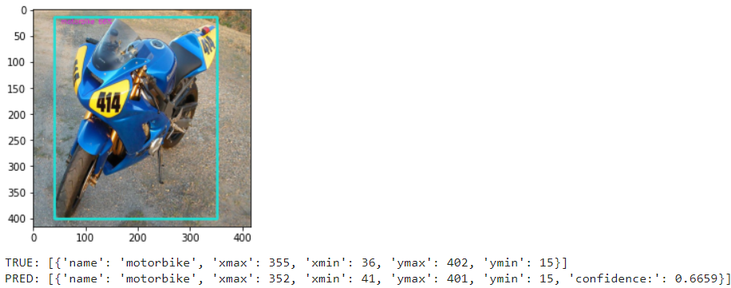

# **SMART SECURITY CAMERA PROJECT**

The files in this repository are used to do training and testing process for object detection models using TensorFlow.

## Dataset Information:

| Type | Detail |
| ----- | ----- |
| Source | [The PASCAL Visual Object Classes Challenge 2012 (VOC2012) Results](http://host.robots.ox.ac.uk/pascal/VOC/voc2012/) |
| Author | Everingham, M. and Van~Gool, L. and Williams, C. K. I. and Winn, J. and Zisserman, A. |

## Data Preparation
Berikut ini adalah tahapan-tahapan dalam melakukan _data preparation_: 

- Parsing the annotations 
Parsing the annotations data previously in xml format into a python dictionary.

- Data filtering 
Perform data filtering where only data labeled bicycle, bus, car, motorbike, and person are taken.

- Data splitting 
Split the dataset into train data, validation data, and test data.

- Resize and normalize image data 
Perform resizing and normalizing on data images so that they have the same dimentional size and range of values.

- Finding anchor boxes 
Find the number of clusters and centroids value that represent all width and height data using the cluster kmean where each distance calculated using the intersection over union (IOU) method.

- Rescale the object configuration 
Rescale all object configurations such as center x, center y, and data anchor boxes into a grid cell scale.

## Modeling

This object detection system in this project is built using the YOLOv2 algorithm. The model is trainned using tensorflow keras models.

In the modeling process, a transfer learning process is carried out where several weights in keras model layers are initialized with the values obtained from the [yolov2 weight](https://pjreddie.com/darknet/yolov2/). Then, do model training process.

The model prediction output is still raw data output. These results need to be rescaled such as the prediction output for the data width, height, and confidence is rescaled using sigmoid calculations, the prediction output for anchor boxes is rescaled using exponential calculations, and the predicted label output is rescaled using softmax calculations. Then finding the best predictied object boxes based on comparation each bounding box using intersection over union (IOU) calculation and the specified threshold confidence value.

## Model Results

The following are the results of the model prediction results on data test:

- 
- 

## How to use

The following are the steps to use this repository:

1. Run the train.ipnb file on google colab using GPU, this process will generate a model where this model will later be stored directly on the mounted google drive account. 
OR 
You can also download the model directly via this link: [LINK](https://drive.google.com/drive/folders/1AzrFCmpyjkhPBnCQHWUBDc0IfMfLvrSU?usp=sharing).

2. `conda create --name test python=3.7.13` 
`conda activate test` 
`pip install tensorflow` 
`pip install opencv-python`

3. After the model is obtained, you can detect objects using PC/laptop camera by running the testing.ipynb file in your IDE. Don't forget to load the model and replace the value of the `ANCHORS` variable with the value listed in the model file name.